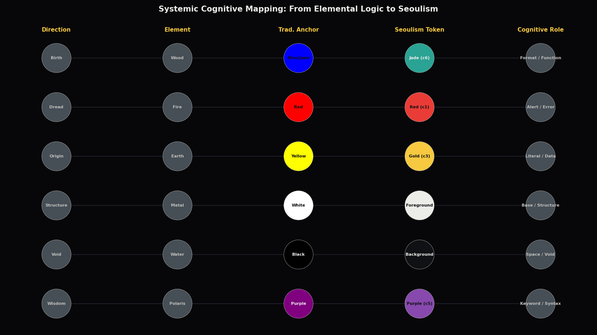
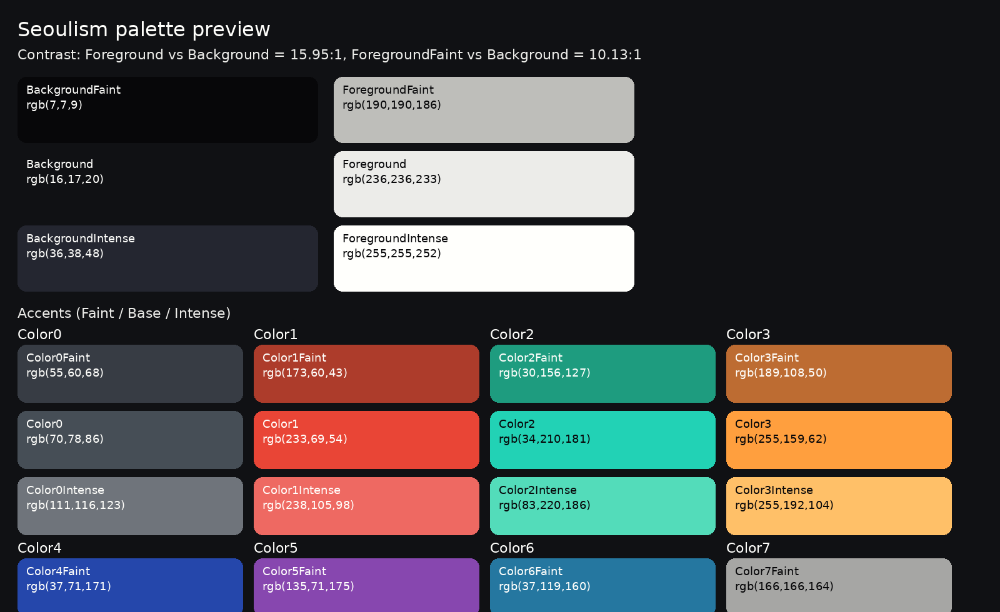
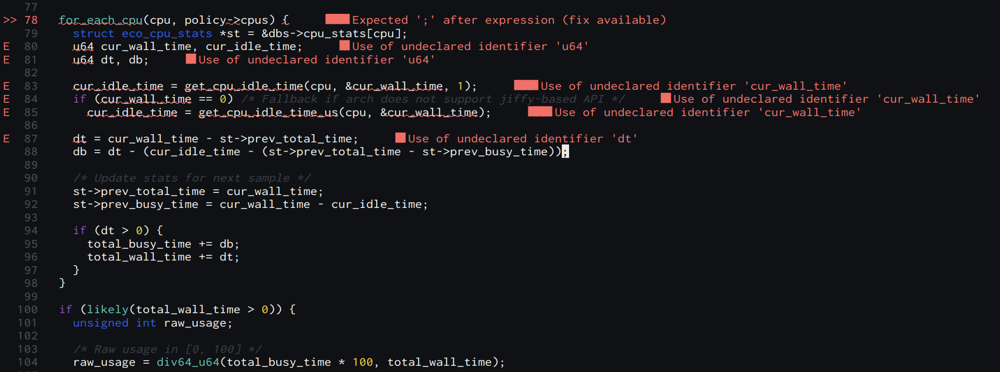

# Seoulism

A Vim and Neovim colorscheme inspired by Korean color tradition and modern Seoul light.

Best with:

* `set termguicolors`

## A Korean palette, made readable

Seoulism takes Korean color sources and translates them into a clean dark UI palette with strong contrast.

### A Gentle Chain of Colors: Five Directional Color Modal
**Eastern aesthetics are more than just a "Zen" cliché; they represent a centuries-old cognitive system.**

I have spent some time developing **Seoulism**, a Vim theme that approaches Eastern aesthetics from a systemic and structural perspective. My goal was to move away from purely mystical or exotic interpretations of the tradition.

While the "Five Directional Colors" (오방색, 五方色) originated in broader East Asian philosophy(by Zou Yan, especially China), its true value lies in how it was localized and reconfigured into a rigorous system of order within Korean culture. By stripping away the mystical layers, I found a profound structural and cognitive-scientific core. This theme is an exploration of that hidden logic. It showcases the systemic thinking inherent in the Korean intellectual tradition.

**Beyond the "Zen" Cliché**

This theme is not about oriental minimalism. It presents a five-axis cognitive system where colors are not decorative but functional tools for categorizing hierarchy and logic. It treats color as a refined algorithm for the modern developer’s mind.

**The Principle of "Scene First, Emotion Later" (선경후정, 先景後情)**

This reflects a long-standing intellectual tradition. In this system, the code is treated as the "Scene," which is the functional reality, and it is rendered with absolute clarity. The comments, representing the "Emotion" or human annotation, are intentionally receded into the background. This hierarchy ensures that human sentiment never overshadows the structural truth of the code.

**Pine Ink Black**

Contrary to China, Korean culture preferred Matt Black with pale blue hint.
Those inks are demonstrated more than a thousand years ago, but this classic tone will still soften your canvas.
This will gently embrace your own flow, without intercepting who you are.

**A Living Spiritual Legacy**

This systemic approach is not a dead relic of the past. It lives on in the minds of Koreans today, and it serves as the invisible foundation for the vibrant aesthetics of modern K-Culture and Engineering. Whether in the calculated choreography of a performance or the sophisticated visual language of a film, one can see this ancient logic of order and harmony at play.

If you find the neon-saturated contrast of contemporary themes too noisy for deep work, Seoulism offers a grounded and humanistic experience.

### A Chain of Colors


This diagram illustrates the cognitive transformation from ancestral elemental anchors to modern UI tokens.

### What inspired the colors

- The traditional Korean five-color system  
  A classic framework built around five symbolic colors: blue, red, yellow, white, and black.  
  Seoulism uses this as a guide for balanced accents and clear visual hierarchy.

- Indigo dyeing  
  Deep blues shaped by the look of dyed fabric rather than flat digital blue.

- Metallic pigments  
  Bold highlights inspired by mineral and metal-like pigments seen in traditional decorative work.

- Safflower red dye  
  Reds tuned to feel warm and vivid, closer to natural dye than “error-only” red.
- Pine Ash Black
  Matt Black tuned to glitter with blue hint.
- Reflective Selection
  When text is selected, it turns into a bright reflective white, simulating a spotlight on a paper-like canvas.

## Install

### Vundle

```vim
set nocompatible
filetype off
set rtp+=~/.vim/bundle/Vundle.vim
call vundle#begin()

Plugin 'VundleVim/Vundle.vim'
Plugin 'gg582/seoulism.vim'

call vundle#end()
filetype plugin indent on

set termguicolors
colorscheme seoulism
````

Run:

* `:PluginInstall`

### Manual

* Vim: `~/.vim/colors/seoulism.vim`
* Neovim: `~/.config/nvim/colors/seoulism.vim`

```vim
set termguicolors
colorscheme Seoulism
```

## Code Tendency Checker
```vimscript
:wopp  " turn on the tendency checker
:noopp " turn off the tendency checker
:warncfg <integer (0-100)> " set the sensitivity within percentage
```

### Code Tendency Mapping

| Dominance | Core Tendency | Structural Context |
| --- | --- | --- |
| **WOOD** (Jade) | **Declarative Birth** | **Header Files**, Interface contracts, Function prototypes, and API definitions. |
| **FIRE** (Red) | **Operational Heat** | **Control Flow**, Main logic loops, Exception handling, and Dynamic execution. |
| **EARTH** (Gold) | **Stable Root** | **Config Tables**, Constant mappings, Hardcoded literals, and Resource datasets. |
| **METAL** (Base) | **Structural Rigidity** | **Type Definitions**, Static schemas, System boilerplate, and Memory allocations. |
| **WATER** (Void) | **Implicit Space** | **Documentation Blocks**, Extensive comments, Code delimiters, and Meta-data. |

---

### Dynamic Balance Tendency

| Dominant Interaction | Code Personality |
| --- | --- |
| **WOOD ➔ EARTH** | **Pure Abstraction**: Focuses on defining high-level interfaces over raw data. |
| **EARTH ➔ WATER** | **Data Concentration**: Optimized for dense information storage and literal values. |
| **WATER ➔ FIRE** | **Contextual Clarity**: Prioritizes thorough documentation and human-readable explanation. |
| **FIRE ➔ METAL** | **Logic Agility**: Prioritizes dynamic execution flow and complex algorithmic branching. |
| **METAL ➔ WOOD** | **Architectural Integrity**: Focuses on robust type-safety and rigid system frameworks. |

## Palette



