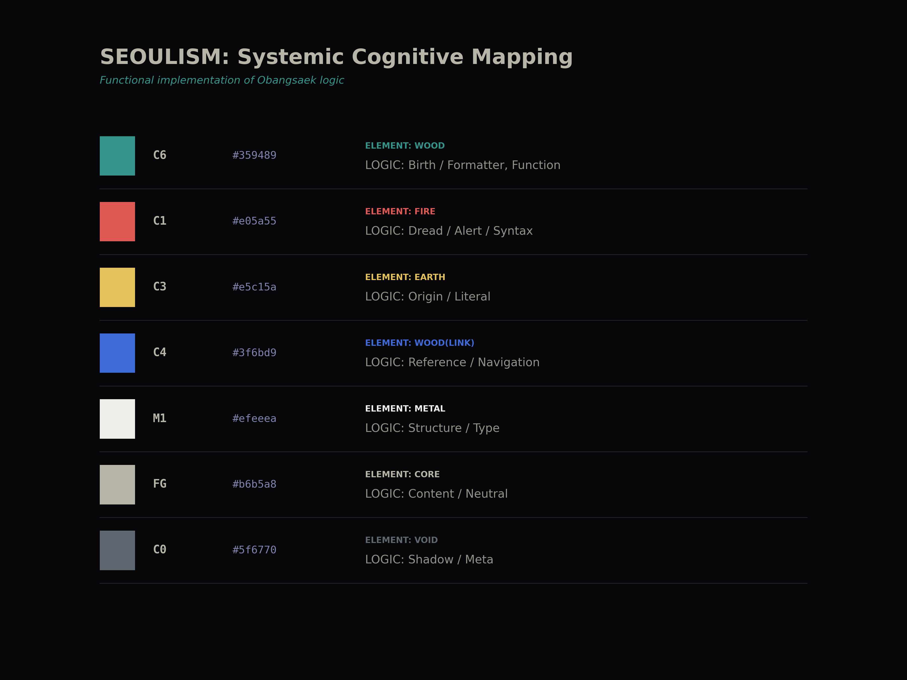

# Seoulism

A Vim and Neovim colorscheme inspired by Korean color tradition and modern Seoul light.



Seoulism translates Korean color sources into a clean dark UI palette with strong contrast. Quiet enough for deep work, sharp enough for structure.

---

## Quick Start

### Vim / Neovim

```vim
" In your init.vim or .vimrc
set termguicolors
colorscheme seoulism
```

### Configuration (Optional)

By default, Seoulism is a clean, standard colorscheme. You can enable optional "Habit Enforcement" or "Structural Analysis" features.

```vim
" Enable 'Rigorous Mode' (Enforces strict color rules for Types and Functions)
" This uses matchadd() to highlight patterns that standard syntax files might miss.
let g:seoulism_rigorous = 1

" Enable 'Structural Balance Checker' (The optional plugin features)
let g:seoulism_enable_checker = 1

" Toggle italics for comments and types (Default: 1)
let g:seoulism_italic = 0
```

---

## A Korean palette, made readable

Seoulism takes Korean color sources and translates them into a modern UI palette designed for clarity and hierarchy.

### A Gentle Chain of Colors: Five Directional Color Model

**Eastern aesthetics are more than a "Zen" cliché; they represent a centuries-old cognitive system.**

I have spent time developing **Seoulism**, a Vim theme that approaches Eastern aesthetics from a systemic and structural perspective. The goal is to move away from purely mystical or exotic interpretations.

While the "Five Directional Colors" (오방색, 五方色) originated in broader East Asian philosophy (commonly linked to Zou Yan and early Chinese cosmology), its real value lies in how it was localized and reconfigured into a rigorous system of order within Korean culture. By stripping away mystical layers, I focused on the structural core: color as a cognitive system for organizing hierarchy and meaning.

#### Beyond the "Zen" cliché

This theme is not about "oriental minimalism." It treats color as functional UI logic: accents are not decoration, but tools for categorizing structure.

#### The Principle of "Scene First, Emotion Later" (선경후정, 先景後情)

In this hierarchy, code is the "Scene"--the functional reality--and is rendered with maximum clarity. Comments (human annotation) are intentionally receded so that sentiment never competes with structure.

#### Pine Ink Black

Korean visual preference often leans toward matte black with a faint blue cast rather than flat pure black. This tone softens the canvas while keeping edges crisp, designed to support flow without getting in your way.

---

## Code Tendency Checker (Optional)

To use the structural checker, you must first enable it in your configuration:

```vim
let g:seoulism_enable_checker = 1
```

Seoulism provides an optional "tendency checker" inspired by the five-color system. It reads your code as a structural mix and reports a dominant tendency profile.

### Commands

```vim
:Opp                  " Turn on real-time tendency checking (alias: :wopp)
:NoOpp                " Turn off tendency checking (alias: :noopp)
```

### Risk notice & checkpoint markers

When the difference between the dominant and the suppressed element exceeds `g:seoulism_risk_gap` (40% by default), the checker marks the problematic line range with an `s` sign in the gutter.

```vim
let g:seoulism_warn_opp = 1             " Auto-start checking on load
let g:seoulism_risk_gap = 40.0          " Adjust when the notice appears
let g:seoulism_checkpoint_span = 24     " Lines per checkpoint window
```

---

## Install

### Vim-plug (Vim / Neovim)

```vim
call plug#begin()
Plug 'gg582/seoulism.vim'
call plug#end()

set termguicolors
colorscheme seoulism
```

### Native package install (Vim 8+)

```sh
git clone https://github.com/gg582/seoulism.vim.git ~/.vim/pack/seoulism/start/seoulism
```

---

## Notes

* A truecolor terminal is strongly recommended (`set termguicolors`).
* If your terminal does not support truecolor, the palette may flatten.

---

## License

See `LICENSE`.